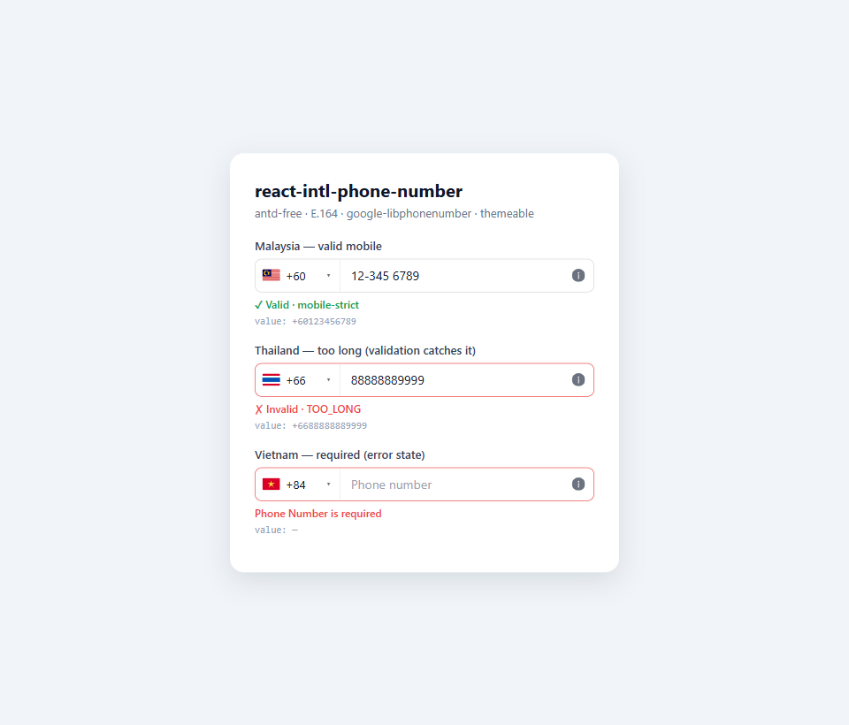
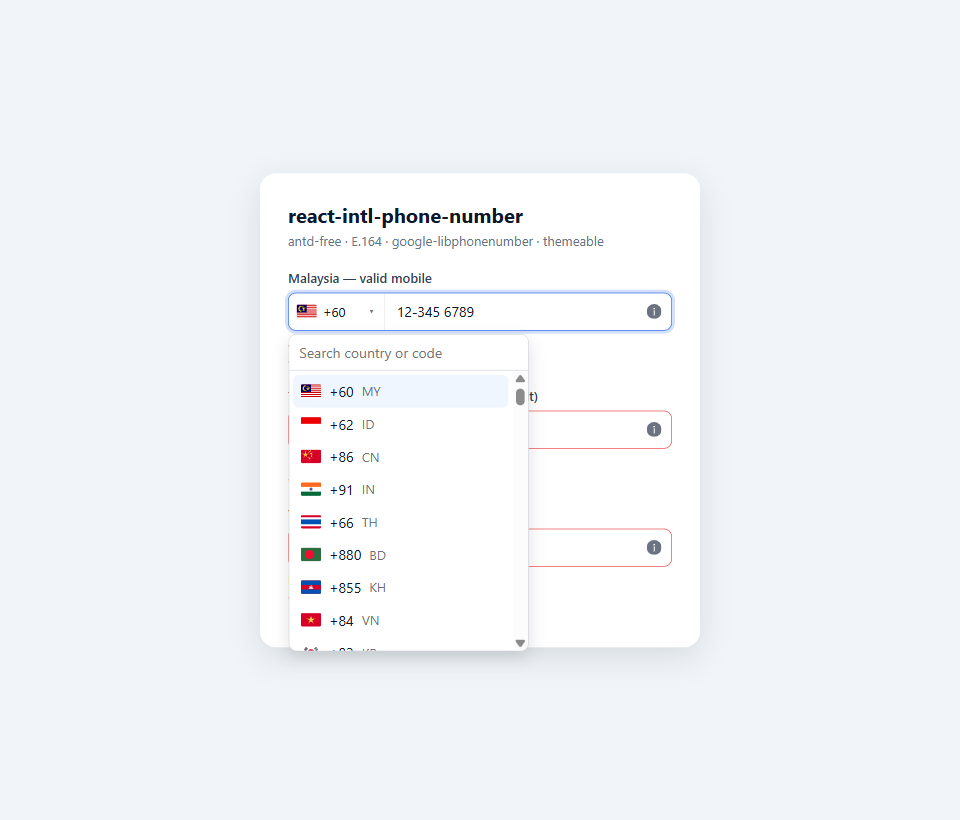
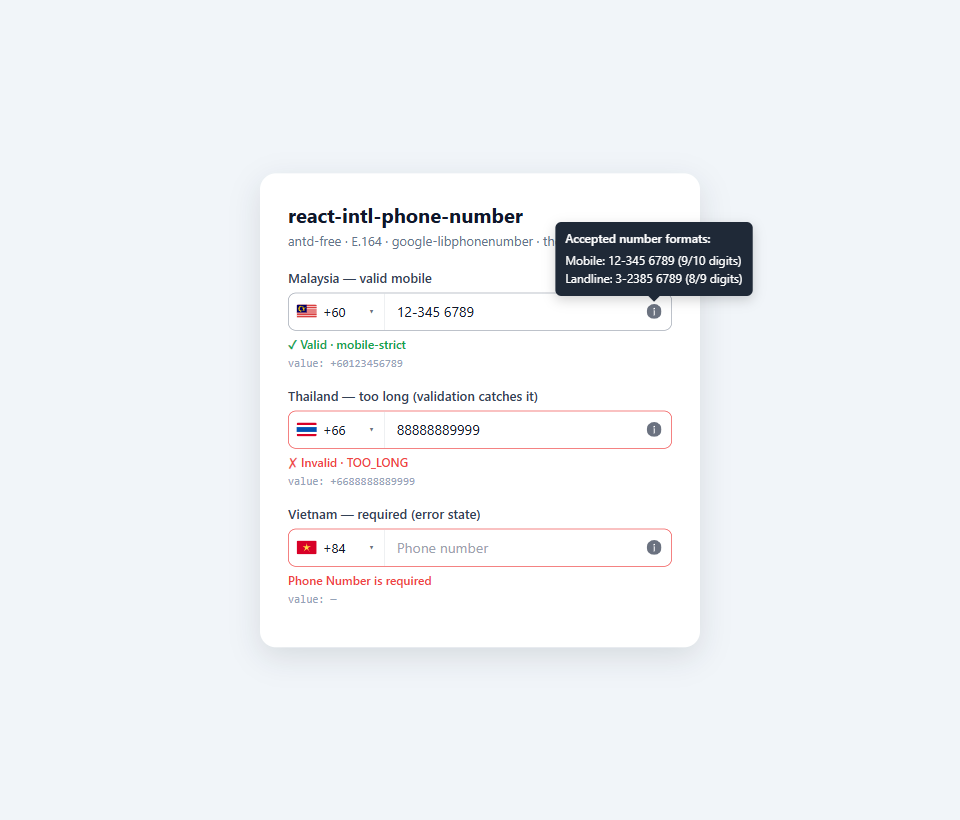

# react-intl-phone-number

A framework-agnostic, **Ant-Design-free** international phone number input for React.

- 🌍 Searchable country dropdown — pick by **flag** or by **calling code** (`+60`, `+66`, …).
- 📞 E.164 in / out, powered by [`google-libphonenumber`](https://github.com/ruimarinho/google-libphonenumber).
- 🎚️ Configurable, **required** `validationLevel`: `strict` / `mobile-strict` / `loose`.
- 🎨 Modern, themeable CSS — every part is a CSS variable and every node accepts a
  `classNames` override, so external utilities (e.g. Tailwind) win without `!important`.
- 🌐 i18n via a `messages` object (English defaults) **and/or** your own `t()` function.
- 🧩 Framework-agnostic core (`react-intl-phone-number/core`) — validate without React.

## Preview

| Leveled validation | Country / code picker | Format hints |
| :---: | :---: | :---: |
|  |  |  |

## Install

```bash
npm i react-intl-phone-number
```

Peer dependencies (declared, so most package managers install them automatically):

```bash
npm i react react-dom google-libphonenumber
```

> `google-libphonenumber` ships full metadata (~hundreds of KB). It is a **peer
> dependency** so it is installed once and shared with the rest of your app rather
> than bundled into this package.

## Quick start

```tsx
import { useState } from "react"
import PhoneNumberInput from "react-intl-phone-number"
import "react-intl-phone-number/styles.css" // import once, anywhere in your app

function Example() {
  const [phone, setPhone] = useState("") // E.164, e.g. "+66948383493"
  return (
    <PhoneNumberInput
      value={phone}
      onChange={setPhone}
      defaultCountry="MY"
      validationLevel="mobile-strict"
    />
  )
}
```

Using CommonJS / `require`? The component is the `default` (or the named export):

```js
const { PhoneNumberInput, validatePhoneNumber } = require("react-intl-phone-number")
```

## Validation levels

`validationLevel` is **required** — you decide how strict per use case.

| level | mobile | landline |
| --- | --- | --- |
| `strict` | pattern-valid (`isValidNumber`) | pattern-valid |
| `mobile-strict` | pattern-valid | length-checked only |
| `loose` | length-checked only | length-checked only |

> **Note on `mobile-strict`:** in countries where mobile and landline share length
> ranges (US / MY / TH …), a possible-length number is accepted via the landline
> "length-only" branch, so `mobile-strict` only rejects a number that is
> mobile-length-possible, mobile-pattern-invalid, **and** not a possible landline
> length. The mobile-vs-landline distinction is only observable in regions whose
> mobile and landline lengths are disjoint.

## i18n

Both are optional; built-in English is used otherwise.

```tsx
// (a) messages object — override any subset of strings
<PhoneNumberInput
  validationLevel="strict"
  messages={{ zeroHint: "Cannot start with 0", ruleHintTitle: "Accepted formats:" }}
/>

// (b) translate function (e.g. react-i18next) — wins over messages when both set.
// Keyed by Label_PhoneNumber_* so existing locale files work unchanged.
<PhoneNumberInput validationLevel="strict" t={(key, vars) => i18n.t(key, vars)} />
```

## Props

| prop | type | notes |
| --- | --- | --- |
| `value` | `string` | controlled E.164 |
| `onChange` | `(value: string) => void` | emits E.164 when valid, else a truthy `+<cc><digits>` partial |
| `onBlur` | `() => void` | |
| `defaultCountry` | `CountryCode` | changing it adopts the country and clears the number |
| `disabled` | `boolean` | |
| `validationLevel` | `'strict' \| 'mobile-strict' \| 'loose'` | **required** |
| `hintTypes` | `PhoneNumberKind[]` | info-icon tooltip types; default mobile + landline |
| `messages` | `Partial<Messages>` | i18n overrides |
| `t` | `(key, vars?) => string` | translate fn; wins over `messages` |
| `onValidityChange` | `(isValid: boolean) => void` | computed only when provided |
| `className` / `style` | | on the root |
| `classNames` | `Partial<Record<'root'\|'group'\|'select'\|'dropdown'\|'option'\|'input'\|'tooltip'\|'infoIcon', string>>` | per-part overrides (drop in Tailwind classes) |
| `id` / `name` / `aria-label` / `inputRef` | | form / a11y plumbing |

## Theming

Override the CSS variables on `.ripn-root` (or globally), or pass `classNames`:

```css
.ripn-root {
  --ripn-radius: 12px;
  --ripn-border-color-focus: #16a34a;
  --ripn-error-color: #dc2626;
}
```

Key tokens: `--ripn-border-color`, `--ripn-border-color-hover`,
`--ripn-border-color-focus`, `--ripn-ring`, `--ripn-radius`, `--ripn-height`,
`--ripn-error-color`, `--ripn-warning-bg`, `--ripn-option-selected-bg`,
`--ripn-tooltip-bg`. Prefer skipping `styles.css` entirely? Pass your own
`classNames.*` for full control.

## Framework-agnostic core

```ts
import {
  validatePhoneNumber,
  getPhoneNumberError,
  phoneReasonI18nKey,
  toE164,
  getPhoneTypeHints,
} from "react-intl-phone-number/core"

validatePhoneNumber("+66948383493", { level: "strict" }) // { valid: true, reason: null }
getPhoneNumberError("+6612") // "TOO_SHORT" (level defaults to "strict")
```

No React, no DOM — usable in form validators or on a server.

## License

MIT
